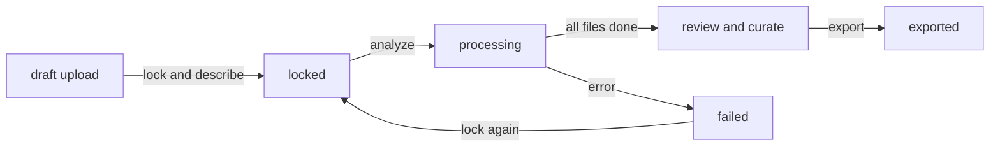

# About Microstock

Microstock takes a folder of images and produces the metadata a stock marketplace expects: a title, a description, a category, and keywords. The heavy lifting is done by AI, while you remain in control of the final result. The robots draft; you decide whether the comma belongs there.

It is not a separate drive. Microstock runs on top of Archivd, inside a dedicated workspace of its own, so your uploads, quota, and file handling all come from the same place.

{/* TODO: screenshot static/img/docs/microstock/about-overview.webp */}

## What it does

1. You upload images into a folder inside a Microstock workspace.
2. You describe the folder as a whole and lock it.
3. The AI analyzes each image and drafts metadata for it.
4. You review and curate the drafts.
5. You export a CSV, and optionally push the files and metadata straight to a marketplace.

## The pipeline

Each step is a state on the collection, shown in the toolbar so you always know where you are: **Lock & Describe**, **Analyze**, **Review**, then **Export**.

## Getting access

Microstock is opt-in. It is not switched on for every account by default.

1. Open the service catalog and activate the Microstock slot entitlement. A free entitlement exists, and additional workspace slots are available as an add-on.
2. Open Archivd. A Microstock workspace appears in the workspace switcher once you have an active slot, or you can create one directly from the switcher.
3. Upload your images into a folder inside that workspace. That folder is your first collection.

The workspace is created on demand, so it will not show up until you have the entitlement and ask for it.

## What is different from a normal Archivd folder

| Behavior | Microstock workspace |
|----------|----------------------|
| Allowed uploads | Images only: JPEG, PNG, WebP, GIF |
| Upload location | Inside a folder, never at the workspace root |
| Folder meaning | A collection with a lifecycle and a status |
| Storage | Counts against your Archivd quota, like any other file |

Everything else, including nested folders, trash, and the quota bar, works as it does elsewhere in Archivd.

:::note
Because Microstock stores its files in Archivd, your storage plan and quota apply here too. See [Storage and Plans](/docs/archivd/storage-and-plans) if you need more room, and [Credits and Usage](/docs/microstock/credits-and-usage) for the AI analysis side of billing.
:::

## Next steps

- [Collections](/docs/microstock/collections) for the full workflow.
- [Export and Upload](/docs/microstock/export-and-upload) for CSV and marketplace delivery.
- [Credits and Usage](/docs/microstock/credits-and-usage) for AI billing.
